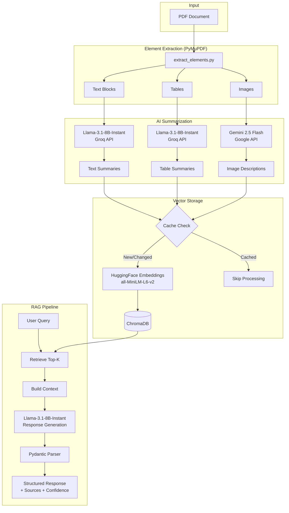

# Multimodal RAG System

A production-ready Retrieval-Augmented Generation (RAG) system that processes PDFs to extract and intelligently summarize text, tables, and images using state-of-the-art AI models.

## 🌟 Features

- **Multimodal Processing**: Handles text, tables, and images from PDF documents
- **Smart Caching**: Avoids redundant processing with intelligent hash-based caching
- **Zero-Cost Operation**: Uses only free-tier APIs and local embeddings
- **No External Dependencies**: PyMuPDF-based extraction for texts, tables and images
- **Structured Responses**: Pydantic-validated outputs with source attribution
- **Interactive Q&A**: Real-time question answering with confidence scoring

## 🏗️ Architecture



## 🔧 Tech Stack

| Component | Technology | Purpose |
|-----------|-----------|---------|
| **PDF Processing** | PyMuPDF (fitz) | Extract text, tables, and images |
| **Text/Table AI** | Llama-3.1-8B-Instant (Groq) | Fast, cost-effective summarization |
| **Image AI** | Gemini 2.5 Flash (Google) | Detailed visual descriptions |
| **Embeddings** | HuggingFace Sentence-Transformers | Free local embeddings (all-MiniLM-L6-v2) |
| **Vector DB** | ChromaDB | Persistent vector storage |
| **Framework** | LangChain | RAG orchestration |
| **Validation** | Pydantic | Structured output parsing |

## 📦 Installation

### Prerequisites
- Python 3.8+
- Virtual environment (recommended)

### Setup

1. **Clone the repository**
```bash
cd multimodal-rag
```

2. **Create virtual environment**
```bash
python -m venv venv
```

3. **Activate virtual environment**
```bash
# Windows
.\venv\Scripts\activate

# Linux/Mac
source venv/bin/activate
```

4. **Install dependencies**
```bash
pip install -r requirements.txt
```

5. **Configure API keys**

Create a `.env` file in the project root:
```env
GROQ_API_KEY=your_groq_api_key_here
GEMINI_API_KEY=your_gemini_api_key_here
```

**Get free API keys:**
- **Groq**: https://console.groq.com/keys (Free tier: 30 RPM)
- **Gemini**: https://aistudio.google.com/apikey (Free tier: 15 RPM)

## 🚀 Usage

### Basic Usage

```bash
python main.py
```

The system will:
1. Extract elements from `docs/attention-is-all-you-need.pdf`
2. Generate AI summaries (or load from cache)
3. Store in ChromaDB
4. Start interactive Q&A session

### Interactive Commands

```
❓ Your question: What is the Transformer architecture?
  # Get AI-generated answer with sources

❓ Your question: clear
  # Clear cache to force re-processing

❓ Your question: quit
  # Exit the program
```

### Example Query

```
❓ Your question: Explain the attention mechanism

ANSWER:
The attention mechanism allows the model to focus on different parts of the input 
when processing each element. It computes a weighted sum of values based on the 
compatibility between queries and keys...

SOURCES (5):
  [1] TEXT (Page 3)
      Preview: An attention function maps a query and key-value pairs to output...
  [2] TEXT (Page 3)
      Preview: Scaled Dot-Product Attention computes dot products of queries...
  ...

CONFIDENCE: high
```

## 📁 Project Structure & Key Components

```
multimodal-rag/
├── src/
│   ├── extract_elements.py    # PDF Extraction logic
│   ├── generate_summaries.py  # AI Summarization logic
│   ├── vector_store.py         # ChromaDB management
│   └── rag_pipeline.py         # The RETRIEVAL CHAIN and PYDANTIC models
├── docs/
│   └── attention-is-all-you-need.pdf
├── data/
│   ├── cache/                  # Hash-based validation cache
│   └── chroma_db/              # Vector database files
├── main.py                     # Orchestration script
└── README.md
```

## 🧠 Code Analysis: Where is everything?

### 1. The Retrieval Chain (`src/rag_pipeline.py`)
Instead of a pre-built LangChain chain, this project uses a **custom retrieval chain** class `RAGPipeline` that gives you full control over the process:

- **Retrieval Step**: Inside `query()` method, it calls `vector_store.query()`:
  ```python
  retrieved_docs = self.vector_store.query(question, k=k)
  ```
- **Context Construction**: It manually builds the context string with metadata.
- **Generation Step**: It calls the Groq Llama model directly.
- **Logic**: This "Manual Chain" approach is often preferred in production for better debugging and custom handling of sources/confidence compared to `RetrievalQA.from_chain_type`.

### 3. Element Extraction (`src/extract_elements.py`)
Uses PyMuPDF to extract text, tables, and images.
- **Text**: `extract_text_pymupdf`
- **Tables**: `extract_tables_with_pymupdf`using `page.find_tables()`
- **Images**: `extract_images_with_pymupdf`using `page.get_images()`

### 4. Vector Storage (`src/vector_store.py`)
Manages the ChromaDB instance and HuggingFace embeddings.
- **Embeddings**: `HuggingFaceEmbeddings(model_name="all-MiniLM-L6-v2")`
- **Storage**: `self.vectorstore.add_documents()` with rich metadata preservation.

## ⚡ Performance

| Metric | Value |
|--------|-------|
| **First Run** | ~3-5 minutes (146 texts + 1 table + 3 images) |
| **Cached Run** | ~10 seconds ⚡ |
| **Query Response** | ~2-3 seconds |
| **Storage** | ~130KB cache + ChromaDB index |

## 🧪 Testing

Extract elements only:
```bash
python -c "from src.extract_elements import extract_elements; extract_elements('docs/attention-is-all-you-need.pdf')"
```

Test summarization:
```bash
python -c "from src.generate_summaries import generate_text_summary; print(generate_text_summary('Test text'))"
```

## 🔍 Troubleshooting

### PyMuPDF Installation Issues
```bash
pip install --upgrade PyMuPDF
```

### API Rate Limits
- **Groq**: 30 requests/minute (free tier)
- **Gemini**: 15 requests/minute (free tier)

If you hit limits, wait 60 seconds or upgrade API tier.
